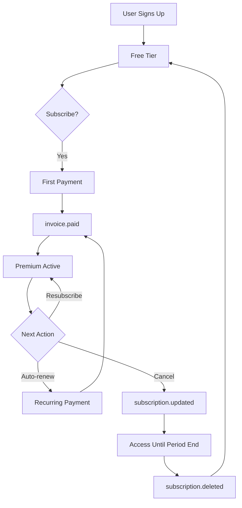

## Overview

The Subscriptions API handles billing and subscription management through Stripe webhooks. This is primarily used by Khoj Cloud to process subscription events automatically.

<Warning>
  This API is designed for Stripe webhooks, not direct user interaction. For self-hosted instances, subscriptions may not be applicable.
</Warning>

## Webhook Endpoint

Stripe sends events to this endpoint to update subscription status.

```bash
POST /api/subscription
```

This endpoint receives and processes Stripe webhook events for:
- New subscription payments
- Subscription updates (upgrades, downgrades)
- Subscription cancellations
- Subscription deletions

### Supported Events

<ParamField body="type" type="string">
  Stripe event type. Supported values:
  
  - `invoice.paid` - Payment successful, activate/renew subscription
  - `customer.subscription.updated` - Subscription modified (cancelled, resubscribed, etc.)
  - `customer.subscription.deleted` - Subscription permanently deleted
</ParamField>

### Webhook Security

The endpoint verifies webhook signatures using Stripe's signing secret to ensure authenticity.

```javascript
const signature = request.headers['stripe-signature'];
const event = stripe.webhooks.constructEvent(
  payload,
  signature,
  STRIPE_SIGNING_SECRET
);
```

### Event Processing

#### invoice.paid

When an invoice is paid successfully:

1. Retrieves the subscription and renewal date
2. Marks the user as subscribed
3. Updates the renewal date to the next billing period
4. Creates a new user account if this is their first payment

#### customer.subscription.updated

When a subscription is modified:

1. Checks if subscription is set to cancel at period end
2. Updates `is_recurring` status accordingly
3. Updates renewal date if changed

Common scenarios:
- User cancels renewal (sets `cancel_at_period_end` to true)
- User resumes cancelled subscription (sets `cancel_at_period_end` to false)
- Subscription plan changes

#### customer.subscription.deleted

When a subscription is deleted:

1. Marks user as unsubscribed
2. Clears renewal date
3. Resets subscription to free tier

### Response

```json
{
  "success": true
}
```

If webhook processing fails, returns `{"success": false}`.

## User Subscription Management

These endpoints allow users to manage their own subscriptions.

### Update Subscription

Cancel or resume your subscription.

```bash Cancel Subscription
curl -X PATCH "https://app.khoj.dev/api/subscription?operation=cancel" \
  -H "Authorization: Bearer YOUR_API_TOKEN"
```

```bash Resume Subscription
curl -X PATCH "https://app.khoj.dev/api/subscription?operation=resubscribe" \
  -H "Authorization: Bearer YOUR_API_TOKEN"
```

<ParamField query="operation" type="string" required>
  Operation to perform:
  - `cancel` - Cancel recurring subscription (access until end of billing period)
  - `resubscribe` - Resume a cancelled subscription
</ParamField>

**Response**

```json
{
  "success": true,
  "message": "Subscription cancelled" // or "Subscription resumed"
}
```

<Note>
  When you cancel, you retain access until the end of your current billing period. The subscription won't auto-renew.
</Note>

## Subscription Tiers

Khoj Cloud offers different subscription tiers with varying features:

### Free Tier

- Basic chat access with limited daily messages
- 50MB indexed content
- Lower rate limits
- Access to basic models

### Premium Tier

- Higher message limits (75+ per day)
- 500MB indexed content
- Higher rate limits across all endpoints
- Access to advanced models (GPT-4, Claude Opus, etc.)
- Priority support

### Checking Subscription Status

You can check if a user has an active subscription via the user info endpoint:

```bash
curl "https://app.khoj.dev/api/v1/user" \
  -H "Authorization: Bearer YOUR_API_TOKEN"
```

**Response**

```json
{
  "email": "user@example.com",
  "username": "user123",
  "is_active": true,  // Premium subscription active
  "has_documents": true,
  "khoj_version": "1.0.0"
}
```

<ResponseField name="is_active" type="boolean">
  Indicates whether the user has an active premium subscription
</ResponseField>

## Product Verification

Khoj Cloud verifies that webhook events are for the official Khoj product:

```python
# Only process events for official product ID
if official_product_id:
    for item in subscription_items:
        if item['price']['product'] == official_product_id:
            valid_product = True
            break
```

This prevents processing webhooks for test products or other Stripe products.

## Configuration

For self-hosted Khoj instances that want to enable billing:

### Environment Variables

```bash
# Stripe API key
STRIPE_API_KEY=sk_live_...

# Webhook signing secret (from Stripe Dashboard)
STRIPE_SIGNING_SECRET=whsec_...

# Your Stripe product ID
STRIPE_KHOJ_PRODUCT_ID=prod_...
```

### Enable Billing

In your Khoj configuration:

```python
state.billing_enabled = True
```

<Warning>
  Billing requires proper Stripe configuration. Test thoroughly with Stripe test mode before enabling in production.
</Warning>

## Setting Up Stripe Webhooks

If you're running your own Khoj instance with billing:

<Steps>
  <Step title="Create Webhook Endpoint">
    In Stripe Dashboard, create a webhook endpoint pointing to `https://your-domain.com/api/subscription`
  </Step>
  
  <Step title="Select Events">
    Subscribe to these events:
    - `invoice.paid`
    - `customer.subscription.updated`
    - `customer.subscription.deleted`
  </Step>
  
  <Step title="Get Signing Secret">
    Copy the webhook signing secret from Stripe and add to environment variables
  </Step>
  
  <Step title="Test Webhook">
    Use Stripe CLI or Dashboard to send test events and verify processing
  </Step>
</Steps>

## Subscription Lifecycle



## Error Handling

### Invalid Signature

```python
try:
    event = stripe.Webhook.construct_event(
        payload, signature, endpoint_secret
    )
except stripe.error.SignatureVerificationError:
    return {"error": "Invalid signature"}, 400
```

Stripe signature verification failed. Check your signing secret.

### Invalid Product

```json
{
  "success": false,
  "message": "Event for non-official product, ignoring"
}
```

Webhook is for a different product than configured.

### No Subscription Found

```json
{
  "success": false,
  "message": "No subscription found that is set to cancel"
}
```

Attempted to resume but no cancellation is pending.

## Rate Limits

Webhook endpoints are not rate-limited as they're called by Stripe, not end users. User-facing subscription management endpoints follow standard API rate limits.

## Best Practices

<CardGroup cols={2}>
  <Card title="Webhook Monitoring" icon="chart-line">
    Monitor webhook processing logs to catch and resolve issues quickly.
  </Card>
  
  <Card title="Idempotency" icon="check-double">
    Stripe may send duplicate events. Handle them idempotently.
  </Card>
  
  <Card title="Test Mode" icon="flask">
    Always test webhook processing in Stripe test mode first.
  </Card>
  
  <Card title="Signature Verification" icon="shield">
    Never skip signature verification in production.
  </Card>
</CardGroup>

## Self-Hosted Considerations

For self-hosted Khoj:

- Subscriptions are optional
- Can run in anonymous mode without any billing
- Can implement your own billing logic
- All API features work without subscriptions (no rate limits by default)

## Next Steps

<CardGroup cols={2}>
  <Card title="Authentication" icon="key" href="/api/authentication">
    Set up API authentication
  </Card>
  <Card title="User Settings" icon="user" href="/api/overview">
    Manage user account settings
  </Card>
</CardGroup>
